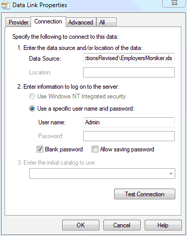

# Create Cover Letters

Before creating cover letters, your [`EmployersMoniker.xlsm`](https://livejohnshopkins-my.sharepoint.com/:x:/g/personal/econplacement_jh_edu/EUXOP3uK5X9EgqUy8v72KgIBi8Bgy5dv53-QYnGkj9ttag?e=hmPSaY)
<!-- #[EmployersMoniker](https://github.com/ccarrollATjhuecon/JobMarket/blob/main/Templates/EmployersMoniker.xlsm) file should already be filled according to its instructions. -->

Depending whether you are using Office 2003, 2007 or 2010 and later, what you see on your screen may be slightly different from the instructions below. The instruction is based on Office 2007.

The template for creating cover letters for your mass mailing is [CreateCoverLetters](https://github.com/ccarrollATjhuecon/JobMarket/blob/main/Templates/) document in [Templates](https://github.com/ccarrollATjhuecon/JobMarket/blob/main/Templates/)

When you open your copy of this document, click "Enable Macros" at the pop-up warning window.

- Then there will be an error message, continue to click "OK" because your target **EmployersMoniker** file is almost surely not in whatever is the default directory. 

- In the resulting  dialog box, replace the default directory at Data Source `C:\Users\dami\Documents\JobMarket\JMInstructionsRevised\EmployersMoniker.xlsm` with the path to your `EmployersMoniker` spreadsheet (presumably mounted via OneDrive desktop sync). (See figure below.) For example, if the path to my `EmployersCarrollCD.xlsm` was 

`/Users/ccarroll/Library/CloudStorage/OneDrive-JohnsHopkins/jobmarket/2023/candidates/CarrollCD/EmployersCarrollCD.xlsm` then this is the path I'd give it.

After replacing the directory, click "OK". `CreateCoverLetters` now should be successfully opened.

In the **Start Mail Merge** group on the **Mailings** tab, click **Step by Step Mail Merge Wizard**. 
 
 
Then, continue clicking **Next Step** until finished. At the step 3 you can confirm or set (if you did not do it when you opened the document) the path to your target **EmployersMoniker** file. Then, write your letter and add the relevant recipient information (Institution, Position, etc.). Finally, preview your letter, and click **Edit individual letters** if you want to further personalize some letters. 
</td>

<tr class="odd">
<td><h3 id="personalization">Personalization</h3>
If you want to further improve the appearance of your labels and cover letters, further reference can be found at <a href="http://office.microsoft.com/en-us/word-help/create-and-print-labels-for-a-mass-mailing-HA010109161.aspx">http://office.microsoft.com/en-us/word-help/create-and-print-labels-for-a-mass-mailing-HA010109161.aspx</a></td>
</tr>
